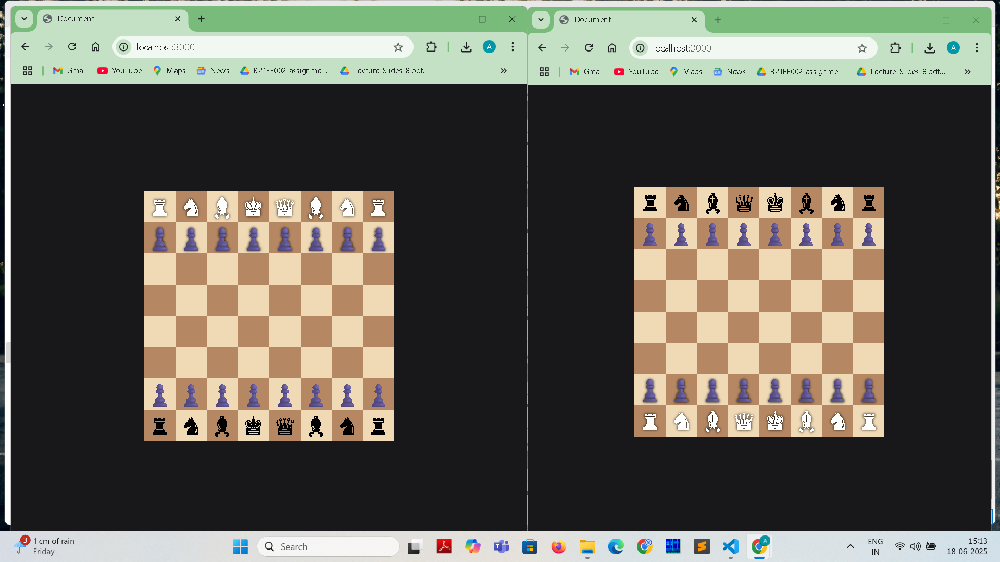
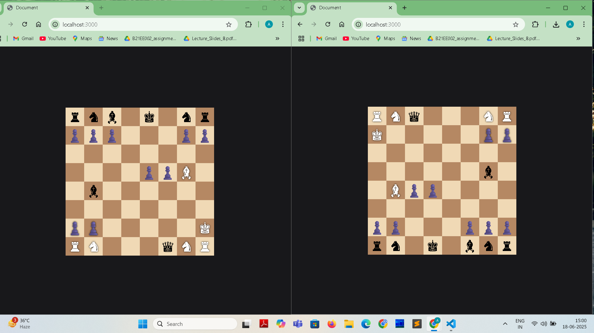
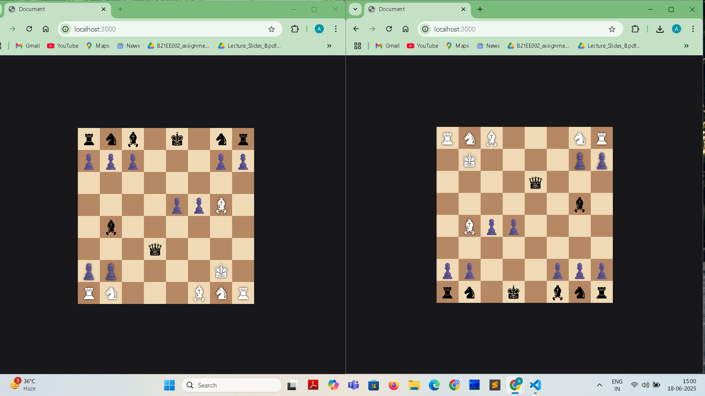
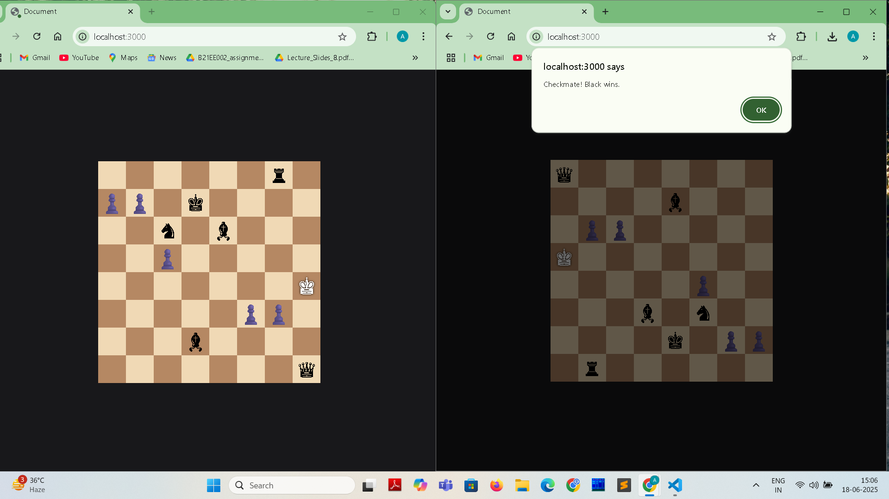

# ♟️ Real-Time Multiplayer Chess Game

This project is a real-time, browser-based multiplayer chess game built using **Socket.IO**, **Node.js**, **Express**, and **chess.js**. It supports two players (White and Black) and additional spectators, with live updates of the game state across all connected clients.

---

## 🚀 Features

- ♟ Real-time gameplay using **WebSockets** (Socket.IO)
- 🔁 Turn-based drag-and-drop piece movement
- 👥 Two-player support with auto-assigned roles (White / Black)
- 🔍 Spectator mode when both player slots are filled
- 🎯 Valid move handling and piece rendering via **chess.js**
- 📲 Responsive design with board flipping for Black player
- ✅ End-game detection (Checkmate with alert)

---

## 📁 Project Structure

```

project-root/
│
├── public/
│ ├── js/
│ │ └── chessgame.js # Frontend game logic
│
│
│
├── views/
│ └── index.ejs # Rendered by Express
│
├── screenshots/ # Images for README and documentation
├── app.js # Main server file (backend)
├── package.json
└── README.md


---

## 🧠 Functional Overview

### ✅ Socket.IO Initialization

- Initializes socket connection:
  ```js
  const socket = io();
  ```

### ♟️ Chess Game Initialization

- Game logic managed by:
  ```js
  const chess = new Chess();
  ```

### 🧩 DOM and Board Setup

- Selects the chessboard container:
  ```js
  const boardElement = document.querySelector(".chessboard");
  ```

### 🖱️ Drag and Drop Handling

- Pieces can be dragged and dropped using:
  - `dragstart`, `dragend`, `dragover`, and `drop` events
- Only the current player can drag their pieces
- Destination squares are updated using `chess.move()` on the server

### 🎨 Board Rendering

- Renders the current state using chess.js FEN
- Uses Unicode for pieces (e.g., ♔, ♚)
- Board auto-flips for Black player

### 📡 Socket.IO Frontend Events

- `playerRole` — Assign player color
- `spectatorRole` — Assign spectator
- `boardState` — Update board state using FEN
- `move` — Animate opponent's move
- `gameOver` — Show alert on checkmate or draw

### 🌐 Server (`app.js`)

- Uses Express to serve static files and render index page
- On connection:
  - Assigns player roles (white/black)
  - Emits current board state
- On move:
  - Validates correct player's turn
  - Updates board
  - Broadcasts move and new state
  - Emits `gameOver` on checkmate

---

## 🛠️ Technologies Used

| Tech         | Role                    |
|--------------|--------------------------|
| Node.js      | Backend runtime          |
| Express.js   | Web server               |
| Socket.IO    | Real-time communication  |
| chess.js     | Game rules and validation|
| EJS          | Server-side rendering    |
| TailwindCSS  | Styling and layout       |

---

## 💻 How to Run Locally

1. **Clone the repository**  
   ```bash
   git clone https://github.com/yourname/chess-socketio.git
   cd chess-socketio
   ```

2. **Install dependencies**  
   ```bash
   npm install
   ```

3. **Start the server**  
   ```bash
   node app.js
   ```

4. **Open the app in your browser**  
   Visit `http://localhost:3000`

---

## ✅ To-Do / Improvements

- [ ] Add restart game functionality
- [ ] Handle draw/stalemate conditions
- [ ] Add in-game chat between players
- [ ] Timer support for blitz mode
- [ ] Player authentication (login system)

---

## 📸 Screenshots

### 🔹 Opening Scene


### 🔹 Some Moves Played


### 🔹 Mid Game Position 1


### 🔹 Mid Game Position 2


### 🔹 Checkmate (Frontend)


### 🔹 Checkmate (Backend Console Log)


---

## 📄 License

This project is open-source and available under the MIT License.
